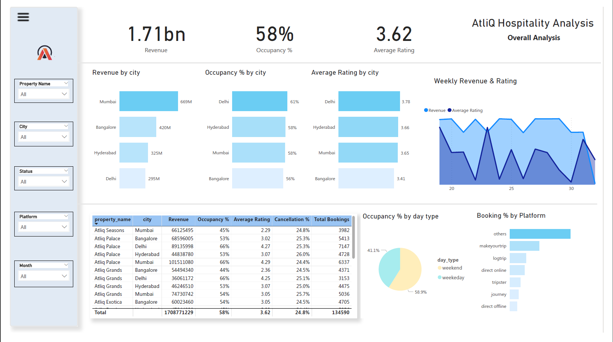
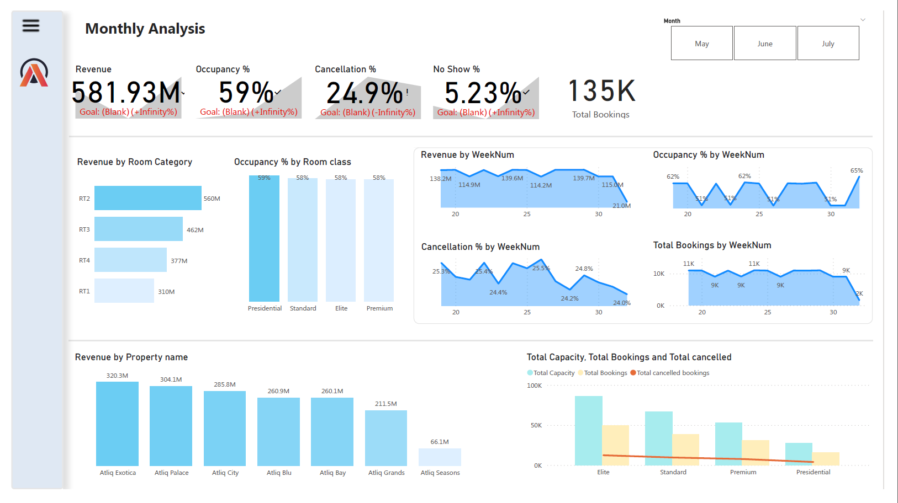

# AtliQ Hospitality Analysis
As a novice in data analysis, I sought to embark on a practical project, leading me to choose the Code Basics Resume Challenge Project 1. I have dedicated my efforts to working on this project.

## Problem Statement 
AtliQ Grands owns multiple five-star hotels across India. They have been in the hospitality industry for the past 20 years. Due to strategic moves from other competitors and ineffective decision-making in management, AtliQ Grands are losing its market share and revenue in the luxury/business hotels category. As a strategic move, the managing director of AtliQ Grands wanted to incorporate “Business and Data Intelligence” to regain their market share and revenue. However, they do not have an in-house data analytics team to provide them with these insights.

Their revenue management team had decided to hire a 3rd party service provider to provide them with insights from their historical data.

Task:  

You are a data analyst who has been provided with sample data and a mock-up dashboard to work on the following task. You can download all relevant documents from the download section.

- Create the metrics according to the metric list.
- Create a dashboard according to the mock-up provided by stakeholders.
- Create relevant insights that are not provided in the metric list/mock-up dashboard.

## Provided Mock-up Dashboard

    

## Data Model

    

## Overall Analysis View

    

## Monthly Analysis View

    

## Insights 
1. Mumbai leads the way with highest revenue, reaching a remarkable 669 million ,followed closely by Bangalore, Hyderabad, and Delhi in that order.
2. Delhi records the lowest revenue, totaling 295 million .
3. Delhi takes the lead in occupancy, boasting an impressive 61%, and also secures the highest average rating at an outstanding 3.78.
4. The occupancy percentage varies by day type, with week-ends registering a solid 58.9%, while weekdays maintain a slightly lower occupancy rate of 41.1%.
5. The Presidential room class enjoys the highest occupancy rate, while the RT2 room category leads in generating the highest revenue.
6. The Elite room class stands out with the highest capacity, total bookings, and unfortunately, also the highest number of canceled bookings.
7. AtliQ Exotica has acheived remarkable revenue of 320 million, showcasing exceptional performance in Mumbai, where it excels in revenue, rating of 3.62, occupancy % of 57%, and cancellation rate as 24.4%.
8. AtliQ Seasons reports the lowest revenue at 700 million.
9. AtliQ lost around 299 million in cancellation.
10. Week 25 recorded the highest revenue , which is 139.7 million.

